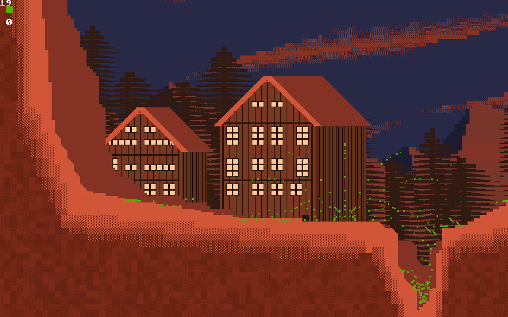
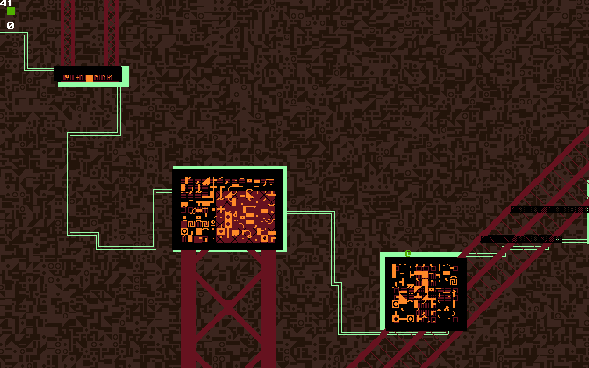
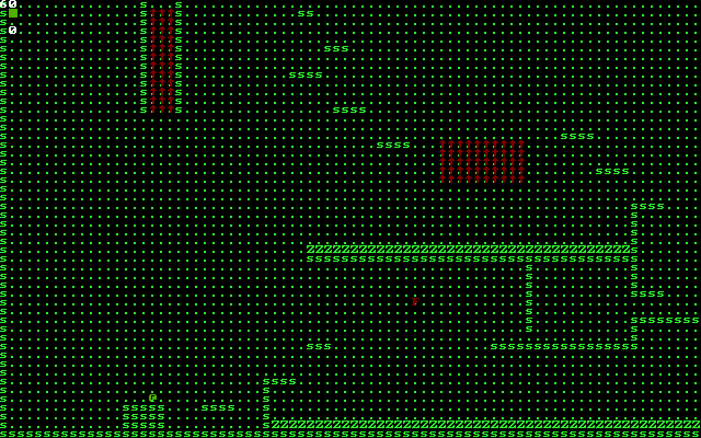
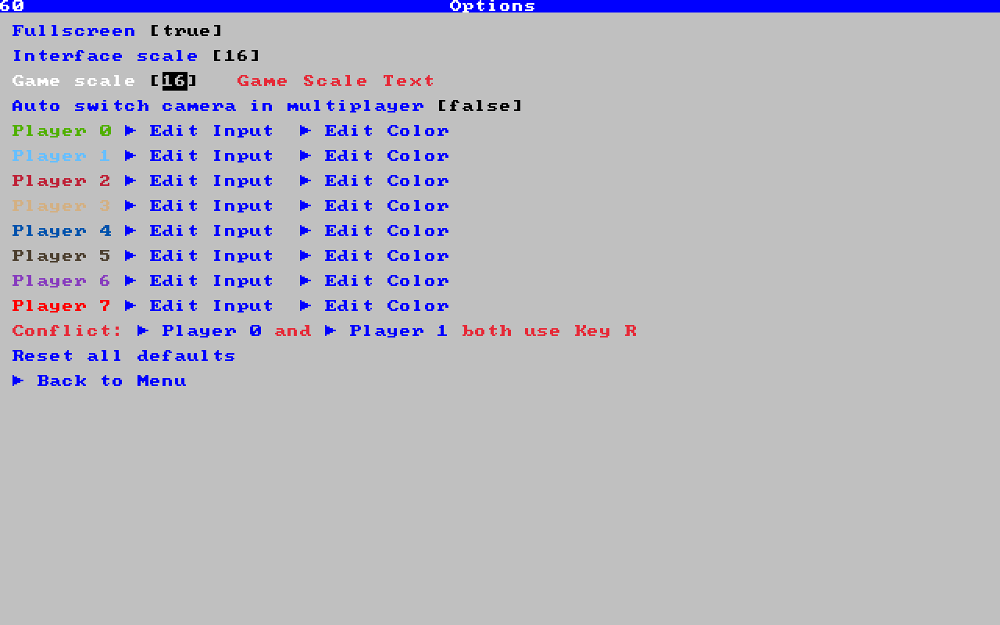
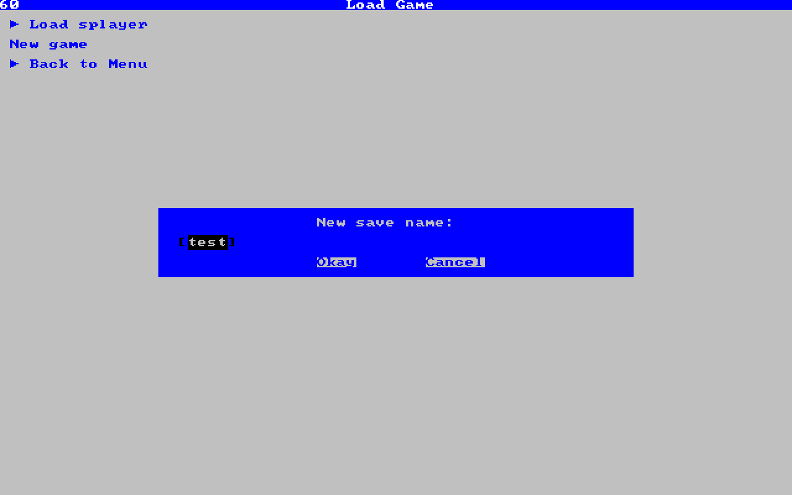

# Ascii-Platformer
WIP platformer using Raylib. All of the graphics are composed of overlapping Unicode characters in
different colors and sizes, inspired by ASCII art; hence the title.

## Gameplay
The final vision for gameplay can be thought of as having three primary components: Combat, 
platforming, and puzzles.

Combat is fairly standard: the player can find and carry multiple guns with
diverse stats (not hard-coded; each gun is specified in the level file) and use them to shoot enemies.

Early in the game, platforming is also fairly standard for a sidescroller; anyone familiar 
with Cave Story will find it mostly familiar, except for the forcefields, which push, pull, 
and fling the player in various directions, and must sometimes be used in addition to just 
jumping between platforms to reach new areas. Later in the game, other avatars or "outfits" are unlocked which
have different abilities or weaknesses, such as outfits that can fly like quadcopters, or which
bounce like in *Within a Deep Forest* by Nifflas, or which can climb vertical walls like in Celeste.
Like the guns, the parameters of any number of outfits can be defined in the level files.

The puzzles consist of using a limited set of bitwise operations, such as AND, OR, XOR, or 
shift, to change a variable's value. Certain special values of the variable can be used like a 
password; when a key is pressed to broadcast them through the level, they activate certain 
level elements, such as forcefields or doors. In effect, the player is "hacking" the level (in 
fact, this mechanic is inspired by how easily certain wireless garage doors can be manipulated 
in a similar way.) These level elements can also be combined to make their own type of 
puzzles, similar to *Portal* or *The Talos Principle* in that each element is well-defined and 
predictable, and the challenge lies in finding out how to combine them.

Obviously, each of these elements can be blended together; for example, solving bit puzzles in order to
be able to control a forcefield which repels an enemy's bullets away from you.

## Under the hood

The project relies on Raylib for handling basic graphical effects, as well as keyboard, mouse, 
and gamepad input. Also, RapidJSON is used for handling save, level, and configuration files.

### Entities and collisions

The core of the engine is an object called the "collider." (I'm awful at coming up with names.) The
collider contains a list of entities, which all implement a common "entity" interface. Each tick,
four functions are called for each entity: tickSet(), tickGet(), finalize(), and print(). In the first
stage, each entity performs its own calculations as necessary. In the second stage, each entity may respond
to the effects of others' calculations. For example, in the first stage, the player might broadcast
a code, and in the second stage, a forcefield might receive that code and store a value which tells
it to activate next tick. finalize() returns true if the object should be deleted, and print() just
displays the entity to the screen.

Many entities also implement the collideable interface, which allows them to interact with 
other entities in the level, by exchanging small structs called "collisions." For example, 
suppose the player entity steps on a pressure plate. It would send a collision to the pressure 
plate entity and the pressure plate entity could respond appropriately, probably by 
broadcasting a code which would trigger another event elsewhere.

Collideables have four additional functions. When called for entity A, doesCollide() returns 
true when called with information about entity B if A needs to send a collision to B; for 
example, if A is the player and B is a pressure plate, then A.doesCollide() returns true if A 
is standing on B. Next A.getCollision() is called, which returns a collision to send to 
B.addCollision(). The fourth function is stopColliding(), which returns true if the 
collideable should be removed from the list of collideables.

Obviously, the number of possible collisions, and therefore calls to doesCollide(), increases 
with the square of the number of collideables. I considered implementing a system where the 
level is divided into sectors, and entiites may only collide with other nearby entities, in 
order to reduce the number of possible collisions. However, I decided it wasn't necessary for 
two reasons. First, in most cases doesCollide() returns false without needing to do very much 
processing, so although it's O(n^2) the coefficient is fairly small. Second, most of the 
particles are placed on a separate list where they receive collisions but cannot send them. If 
there are m particles and n non-particle entities, this brings the number of interactions down 
from O((n + m)^2) to O(n^2 + nm); this is a drastic improvement, since n is usually in the 
tens but m can easily be in the hundreds or thousands. In practice it seems that on older machines,
the GPU is more of a bottleneck than the CPU, so I think this was the right call.

### ...
More to come, maybe, but this is almost entirely a solo project and detailed documentation isn't a priority.
